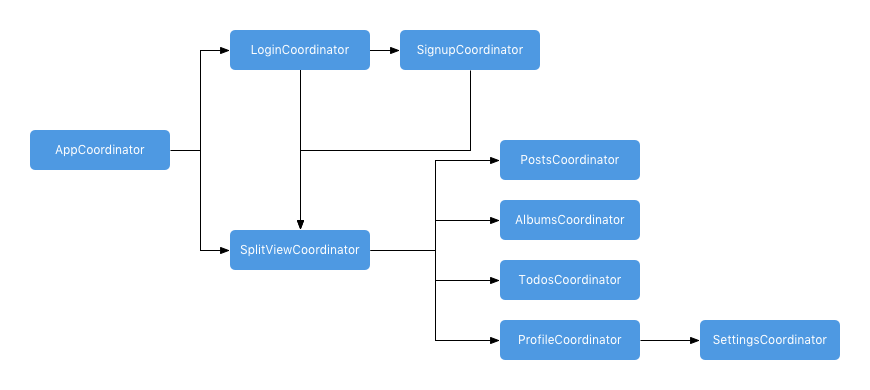
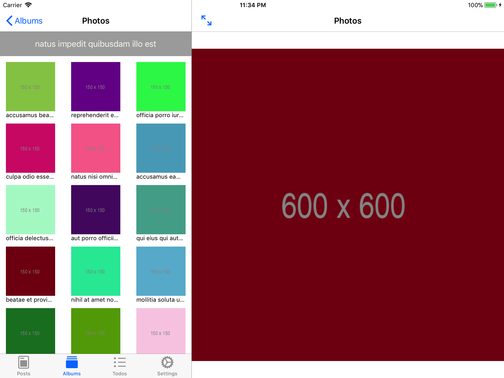
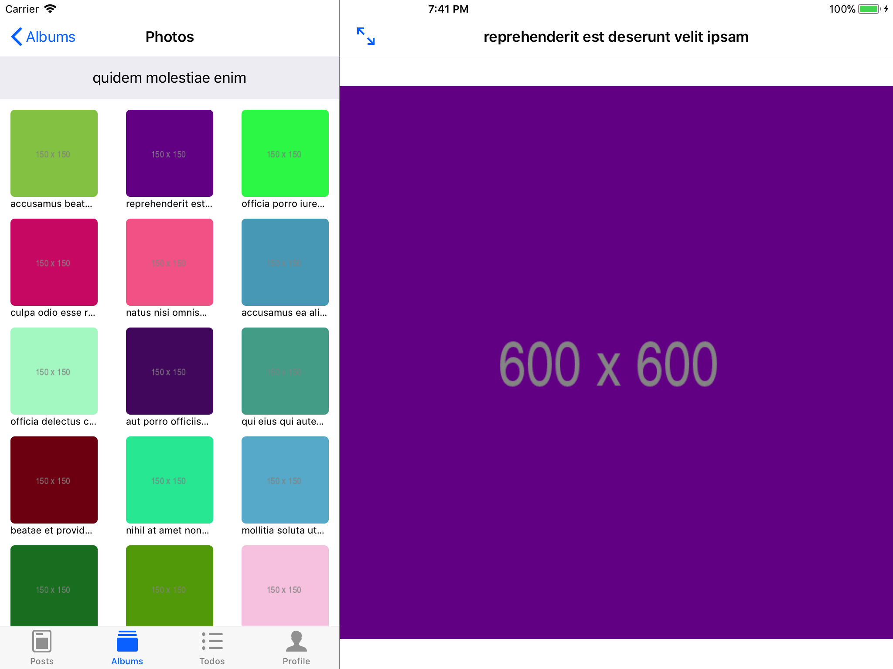

# MVVMC-SplitViewController

### Description
Example project with UITabBarController inside UISplitViewController using RxSwift and MVVM-C architecture.

Loads example data from [JSONPlaceholder](https://jsonplaceholder.typicode.com/)

### Coordinators

### Screenshots

### Requirements

- Xcode 11
- Swift 5
- iOS 11

### Links

- [Coordinators Redux](http://khanlou.com/2015/10/coordinators-redux/)
- [Reactive MVVM](http://www.thomasvisser.me/2017/02/09/mvvm-rx/)
- [Taming Great Complexity: MVVM, Coordinators and RxSwift](https://blog.uptech.team/taming-great-complexity-mvvm-coordinators-and-rxswift-8daf8a76e7fd)
- [CleanArchitectureRxSwift](https://github.com/sergdort/CleanArchitectureRxSwift)
